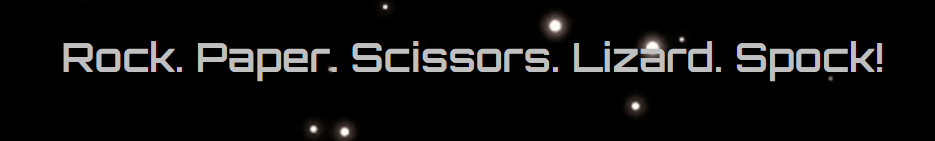

# Project 2- JavaScript

## Rock Paper Scissors Lizard Spock! An interactive game

### Requirements

The project is for a game of 'Rock paper scissors lizard Spock', a version of rock paper scissors but with an added two options a player can pick that are integrated into the game, meaning each new options have interacting moves with the rest of the others. The game comes from an American TV show called 'The Big Bang Theory' which is a show that celebrates self proclaimed 'nerd culture', meaning the show is a comedy written by nerds, for nerds, and celebrates this kind of culture as opposed to mocking it, still while including jokes that would also be described as 'nerdy'. The word nerd was originally an insult but the show and it's viewers have reclaimed it as something to identify by as a community and as individuals. The game I have created has been designed to appeal to this kind of culture, and I have engrained it into the user experience. The user plays against a the computer which selects it's own option and the two answers are compared and the winner is announced. The user can then go back to the game or the main menu once the winner is announced.

The website can be accessed through this [link](https://alistairdriscoll.github.io/project-2/)

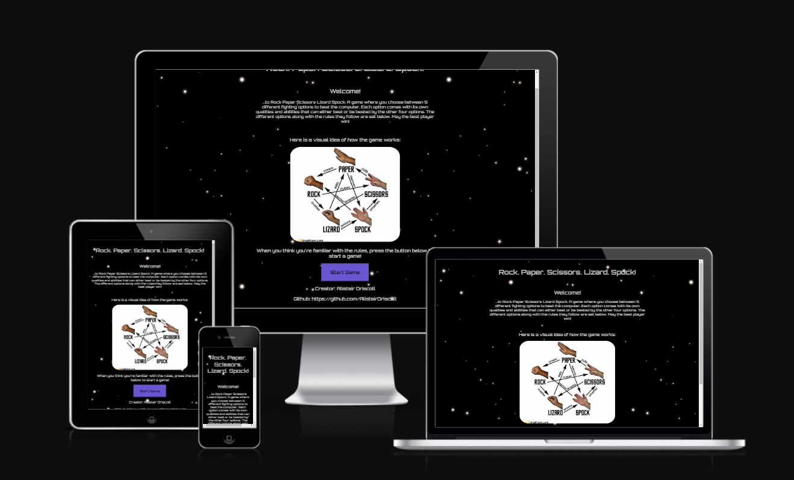

## User stories

### First time goals

- As a First Time Visitor, I want to learn what the website does with ease, and have clear instructions for a fun game and how I'm to play it.

- As a First Time Visitor, I want to easily navigate through the app without any confusion of where I am or what I am to do.

- As a First Time Visitor, I want to be on a website that is all tied together with a theme that both makes sense to the nature of the game and is aesthetically pleasing.

### Returning Visitor goals

- As a Returning Visitor, I want to have a comfortable idea by now of how to use the app and be able to still have a look at things like the rules incase I have forgotten anything.
 
 ### Frequent Visitor goals

 - As a frequent visitor, I should by now have a full understanding of how to use the website and play the rules of the game.

# Features

## The Icon


The icon plays a part in the spirit of The Big Bang Theory as one of the first things the users see. It is a cartoon picture of The 'Starship Enterprise', which is the ship that Spock is a crew member on. One of the jokes on Big Bang Theory is that the characters will use the game to settle arguments over for instance, what to watch on TV, but both characters usually pick Spock, a character they all really admire in the show 'Star Trek', a Sci-Fi franchise that is heavily referenced in the show. The icon acts as a 'if you know, you know' kind of thing that is part of the fun for the user, as the game is meant for people who are like minded to the show characters and are self confessed 'nerds' also, and so seeing the icon they will know that the website is designed for them.

### Metadata

Therefore, the keywords in the metadata I've included the name of the game, Star Trek and The Big Bang Theory, and included 'nerd culture' and 'nerd game' so to make the website easier to find for people looking for this kind of thing. As stated before, the word nerd is something that the people who are into this kind of thing and are into this kind of stuff identify as, so even if the word started off as a bit of an insult and even then not a particularly hurtful one, it most certainly isn't offensive in this context due to the audience identifying as such, and choosing to make the word their own.

## Design

### Font and background


The font carries on with the 'nerdy' theme, I found it by going into google fonts and typing words such as 'space', 'star trek' and 'sci-fi' until I found a font looking more futuristic. A Sci-Fi themed website would obviously be really fitting for the demographic. The background follows this theme, as I looked on the internet for just a picture of outer space. The picure I settled for was my choice as for starters it didn't have as many stars in the background as other pictures, meaning it wasnt going to be a distraction for the user, and there would be less likelihood of the stars interfering with the silver font color I had chosen. I also knew if it had less stars then there would be less chance of it being obvious that the picture is repeating itself in the background. A more keen eyed user may notice that it is repeating across the whole background but it isn't obvious enough to affect user experience in any way. One last thing to add is that with the h1 in the header, there are full stops after every word followed by the exclamation mark at the end word to replicate how people say it when playing the game, like the way both players would count down and then have their answer by the time both shout Spock! at the end, further adding a bit of fun and taking the edge off as it is a game after all.

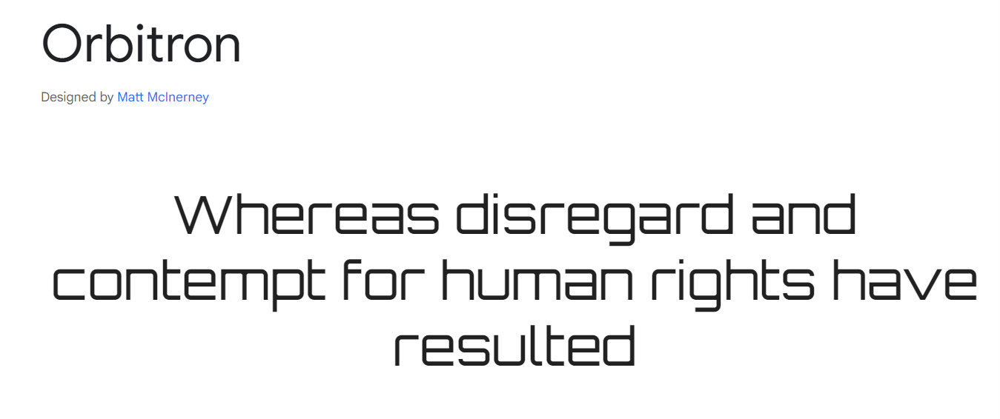

### Buttons

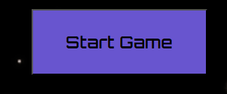

Lastly, the buttons are designed with the hard edges and black border etc to look like buttons on a spaceship, tieing together the whole Sci-Fi theme and making the website something a character from The Big Bang Theory themselves would like the look of.

### The footer

The footer I just decided to add my name and github account using the same font as everywhere else.

### Colours

I did not overcomplicate the colours too much with the website. The font color is silver as it's the colour a customer would usually see in sci-fi themed websites due to it being the kind of colour someone would see on a spaceship. I then chose the blue font from a picture I didn't end up using that also described the rules, I just didn't opt to use this picture in the end as the current one looked better and was more descriptive of the hand signals that accompany each option, for if the user wants to play with a friend. The picture can be seen below. I used an eyedropper extension tool from my browser to get the exact colour as opposed to trying to replicate it.


## Useability

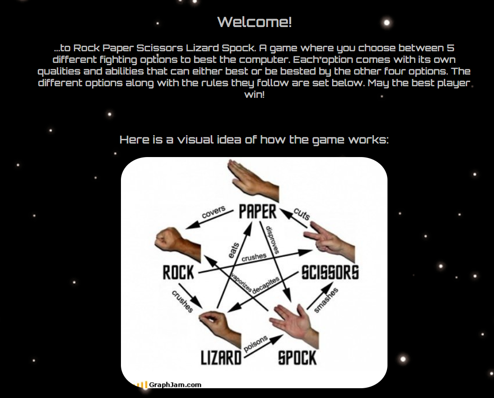
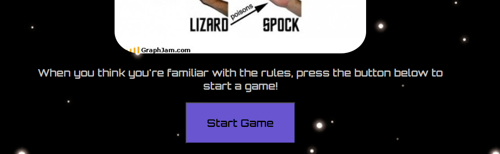

The whole website is only one page split into three different sections that hide and show themselves when needed, taking the user along the path of the website. This saves the browser from having to load a new page whenever the user advances through the website reducing the load time massively. The welcome section can be seen above and the other two parts of the website below. A 'hide' class was created on CSS that was then used to only display what needed to be displayed, and I used javascript to add or take away this class that I added to the event listeners of the buttons that the user would click to progress through the game. The rules are explained in the first page the user sees, which comes with a small welcome message as well as a picture of how the game works, and a button to take them to the next stage of the game when they have an understanding of how things work. The next section is where the user chooses their option and the final part is where the results are announced, being announced in an h2 as either a win, lose or draw, with the player choice, computer choice and outcome underneath, so to fully explain to the user what has occured as opposed to telling them if it is a win or lose without knowing why. The user can then either return to the game for another round or go back to the first page if they want to glance at the rules again.

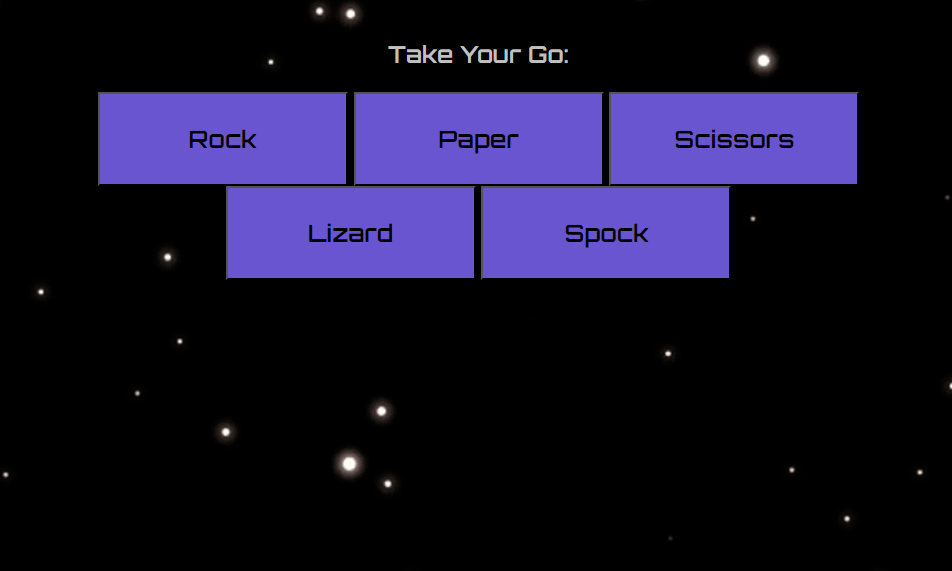
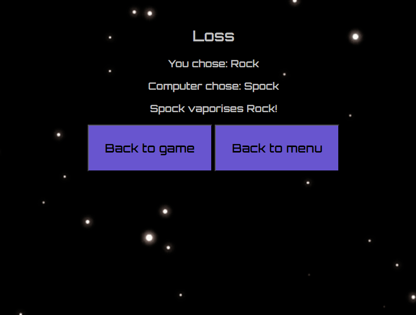

## Technologies used

- HTML was responsible for the structure of the site.
- CSS flexbox was used to arrange the items correctly on their pages.
- CSS was responsible for the look and colouring of the site.
- JavaScript was used to make the website interactive.
- Balsamiq was used to sketch out how the website would look.
- Git, Github were used to upload the project to a cloud.
- Codeanywhere was used at the start of the project to get it onto github then VS Code was used to code out the rest of the project.
- An extension called 'Responsive Viewer' was used to check how the website would look on different screen sizes.
- An extension called 'Eye Dropper' was used to get the right colour scheme for the website.

# Bugs

- I at first struggled to understand why with smaller screens would emit some of the lettering of the text without even an option to scroll, even though I had applied a flex class. This was eventually solved as I realised I hadn't set the size of the image beneath to auto, so it was never shrinking the image below it's full original size to fit the screen. This no shrinking was interacting with the rest of the content as it was staying outside of the screen size and keeping to the same width as the image.

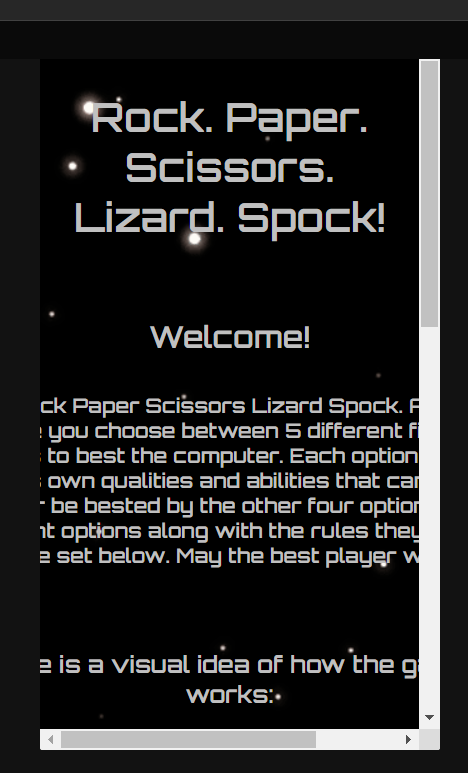

Solution: img {
    max-width: 100%;
    size: auto;
}

- Secondly, I wanted the footer to be set at the bottom of the page at all times, even when there is nothing to go between the main content I would have preferred a big gap. So I set the position of the footer to be absolute. I then realised again when the screen became smaller it started to intefere with the other content and going too high up. I solved this by creating an if statement to take away the class that gives the footer absolute positioning when the screen becomes a certain size.

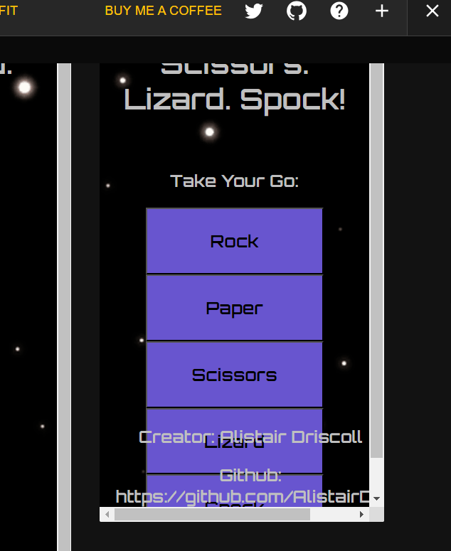

Solution: 
```javascript
if (window.innerWidth <= 400){
  footer.classList.remove("position__absolute");
} else {
  footer.classList.add("position__absolute"); 
}
```


- I had several problems with the code not announcing the correct results, if any results were announced at all. At first the problem was partly solved as sometimes you needed to compare results the right way by means of which symbols. I had used a very big if loop that goes through all the options the user could go through and compare it to the options the computer would have but wasn't consistent enough with the code. A few instances a == was needed instead of just a =, and it would sometimes display the wrong code as the last if loop didn't have another condition, it just had an else {} statement which meant that if something was wrong it would jut defer to this last loop even if that wasn't the right announcement. Also it would sometimes return nothing as a result or announcement as I had gotten confused as to where to put the code that would reset the announcement and results strings to empty strings. A solution was found when I made doing so a function that was called whenever a button to take the user back to the game screened was called.

Solution: function compareChoices(op1, op2) {
  
  // analyse if results are the same
  if (op1 == op2) {
    announce = "You both chose the same!";
    return ["Draw", announce];

    // analyse if player choice is rock
  } else if ((op1 == "Rock")) {
    if ((op2 == "Paper")) {
      announce = "Paper wraps Rock!";
      return ["Loss", announce];

    } else if ((op2 == "Scissors")) {
      announce = "Rock crushes Scissors!";
      return ["Win", announce];

    } else if ((op2 == "Lizard")) {
      announce = "Rock crushes Lizard!";
      return ["Win", announce];

    } else {
      announce = "Spock vaporises Rock!";
      return ["Loss", announce];
    }
    // analyse if player choice is paper
  } else if ((op1 == "Paper")) {

    if ((op2 == "Rock")) {
      announce = "Paper wraps Rock!";
      return ["Win", announce];

    } else if ((op2 == "Scissors")) {
      announce = "Scissors cut Paper!";
      return ["Loss", announce];

    } else if ((op2 == "Lizard")) {
      announce = "Lizard eats Paper!";
      return ["Loss", announce];

    } else if (op2 == "Spock") {
      announce = "Paper disproves Spock!";
      return ["Win", announce];
    }
    // analyse if player choice is scissors
  } else if ((op1 == "Scissors")) {

    if ((op2 == "Rock")) {
      announce = "Rock crushes Scissors!";
      return ["Loss", announce];

    } else if ((op2 == "Paper")) {
      announce = "Scissors cut Paper!";
      return ["Win", announce];

    } else if ((op2 == "Lizard")) {
      announce = "Scissors decapitate Lizard!";
      return ["Win", announce];

    } else if (op2 == "Spock") {
      announce = "Spock smashes Scissors!";
      return ["loss", announce];
    }
    // analyse if player choice is lizard
  } else if ((op1 == "Lizard")) {

    if ((op2 == "Rock")) {
      announce = "Rock crushes Lizard!";
      return ["Loss", announce];

    } else if ((op2 == "Paper")) {
      announce = "Lizard eats Paper!";
      return ["Win", announce];

    } else if ((op2 == "Scissors")) {
      announce = "Scissors decapitate Lizard!";
      return ["Loss", announce];

    } else if (op2 == "Spock") {
      announce = "Lizard poisons Spock!";
      return ["Win", announce];
    }
    // analyse if player choice is spock
  } else if (op1 == 'Spock') {

    if ((op2 == "Rock")) {
      announce = "Spock vaporises Rock!";
      return ["Win", announce];

    } else if ((op2 == "Paper")) {
      announce = "Paper disproves Spock!";
      return ["Loss", announce];

    } else if ((op2 == "Scissors")) {
      announce = "Spock smashes Scissors!";
      return ["Win", announce];

    } else if (op2 == "Lizard") {
      announce = "Lizard poisons Spock!";
      return ["Loss", announce];
    }
  }
}

and the solution to reset the announcement and function: function resetGame() {
  result = "";
  announce = "";
  announcement = "";
}

## Testing on different browsers

### Chrome:

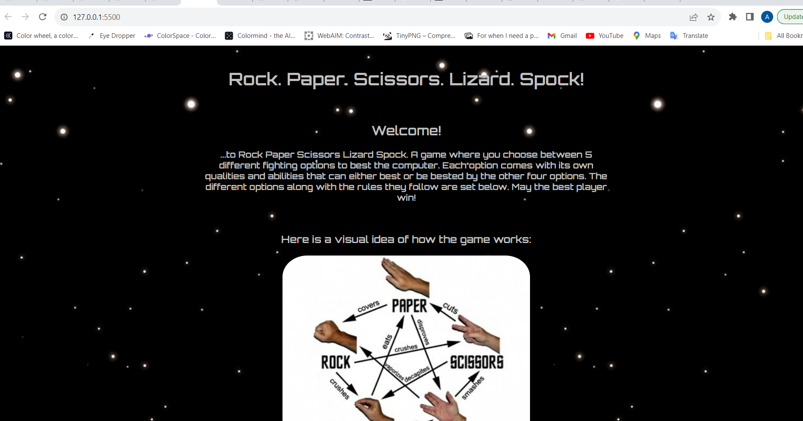
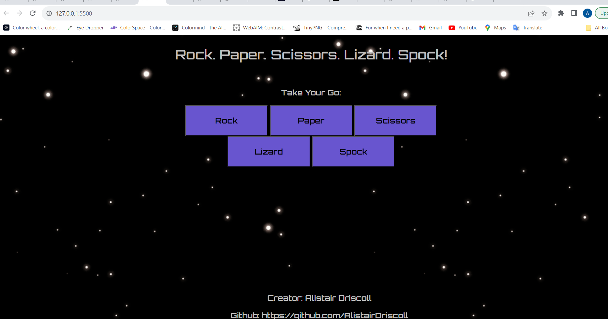
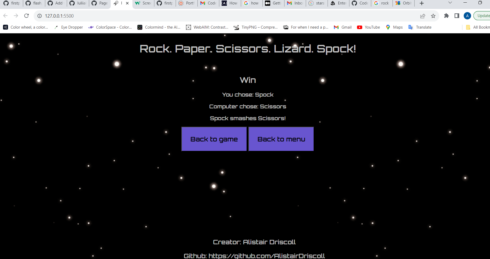

### Firefox

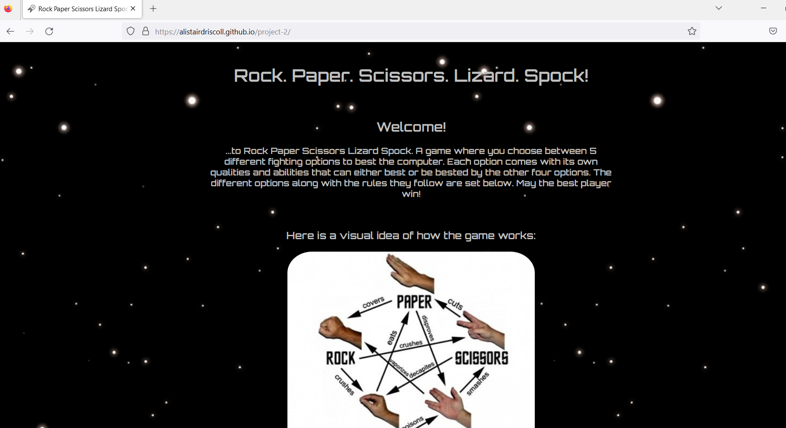
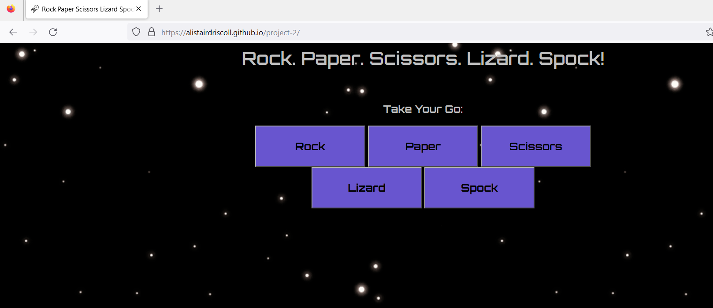


### Microsoft edge

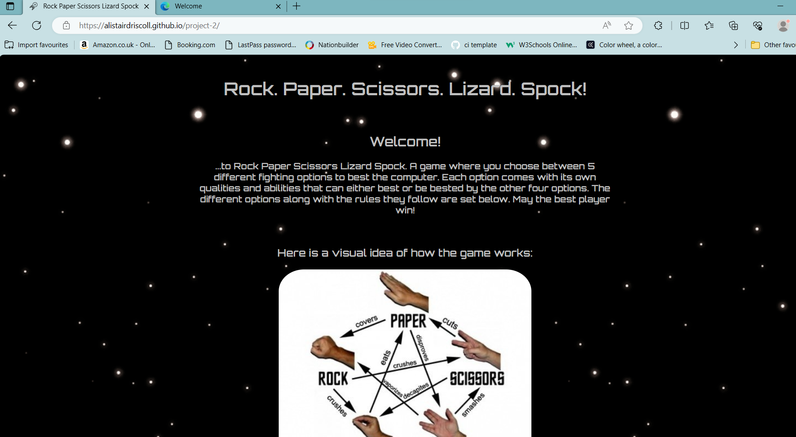
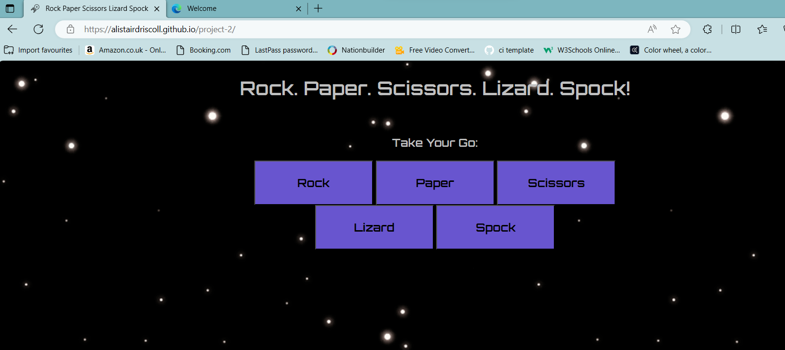
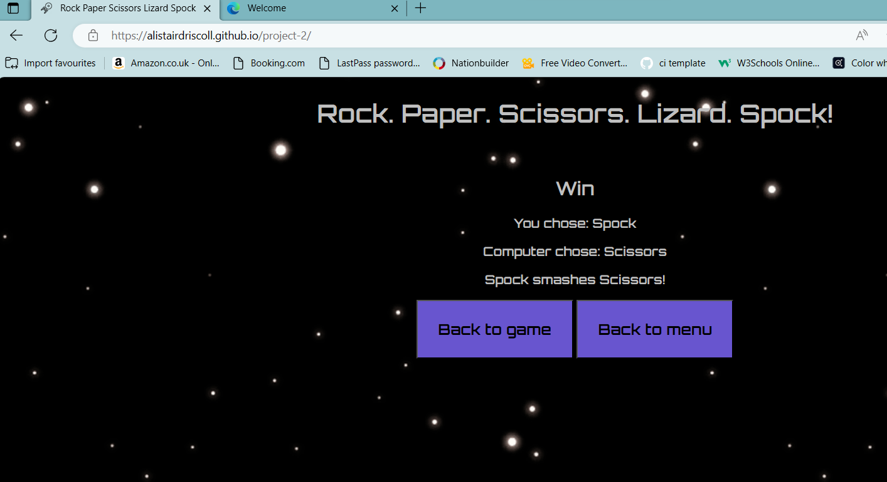

In summary, the website proved to be responsive on all websites.

## Validation

There were a few missing semicolons that I had rectified and I had to delete two consts from the code that I didn't end up using and had forgotten about, these have since been amended.


## Accesibility

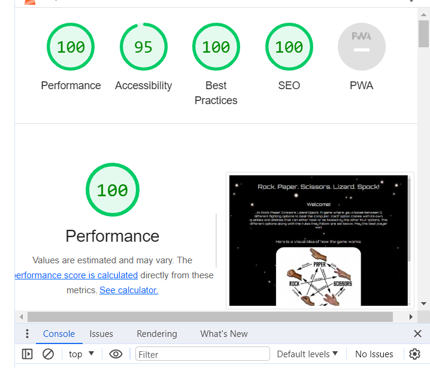

The lighthouse results proved to be more than acceptable. Although I tried applying them to the later sections it seemed to ony want to scan the first part, maybe due to the hide elements applied to the website when first accessed. But given that the colours don't change at all and the theme stays the same, it is safe to assume that the results will also be more than acceptable.

## Deployment

You can visit the website live using this link: https://alistairdriscoll.github.io/project-2/

Alternatively, if you would like to deploy the project locally you can type the following line of code into your IDE terminal:

git clone https://github.com/AlistairDriscoll/project-2.git

## Credits

-The Big Bang Theory
-Star Trek
-Among us, for the inspiration of the spaceship theme
-Julia, my codeinstitute mentor whos advice helped out massively
-Google Images

## Mistakes

Sometimes I forgot to use the correct syntax when putting a message along with my commits. I am aware that you need to always use present tense not past tense but this was done by mistake on several occasions. Using the right language is something I need to work on as a developer.

## Future improvements

A few things to add in the future include a feature where the user can play against another player. I originally chose this project becuase me and my friends settle a lot of arguments (who buys the first round when we're at the pub, who takes the first go when we're playing pool, etc) with a game of rock paper scissors, so I thought a computer version would be a fun way to solve these problems from now on. I therefore wanted to implement a names system where users can enter their names, and a score system where both users are trying to become the first to get three points. I could also reference some private jokes we share together in my friend group also to add some humor to this project me and my mates could enjoy. A final one could be to add colouring to the announcement, so if the player lost then the 'loss' that would be on the results page could maybe be in red writing, and 'win' could be written in gold might be an idea also.